# 64Sqaures

## Description

64 Squares is a sophisticated online chess platform where players can connect with others globally, challenging opponents in real-time matches. This project provides an immersive and intuitive interface for a seamless chess experience.

## Table of Contents

- [Description](#description)
- [Installation](#installation)
- [Usage](#usage)
- [Screenshots](#screenshots)

## Installation

1. **Clone the repository:**

   ```bash
   git clone https://github.com/yash631/64Sqaures.git
   ```

2. **Navigate to the project directory:**

   ```bash
   cd BackEnd
   ```

3. **Install dependencies:**

   ```bash
   npm install
   ```

4. **Start the development server:**

   ```bash
   npm start
   ```

## Usage

Once the development server is running:

1. **Start a New Game**

   - Open the platform in two browser windows or tabs by navigating to http://localhost:5500/FrontEnd/mainGame.html. This will allow two idle players to join the same game.
   - Type your name and click on the "Start a game" button to join a new chess match.

2. **Multiplayer Mode**

   - Once both players have joined the game, the match will begin automatically, with each player being assigned their respective color (white or black), simulating a real-time multiplayer experience on localhost.

3. **Move Pieces**

   - Drag and drop pieces to make your moves. The game will validate legal moves automatically
     in accordance with chess rules.

## Screenshots

### Main Game Screen

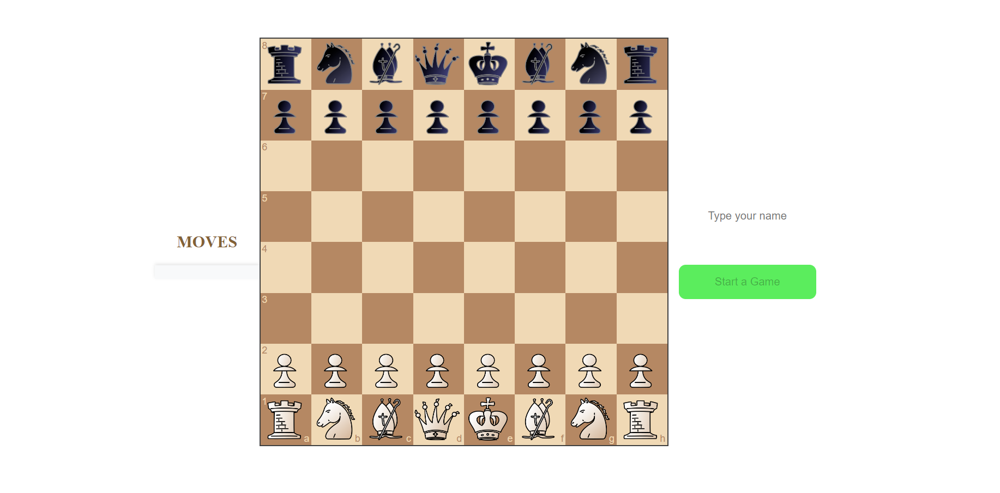

### Match Started

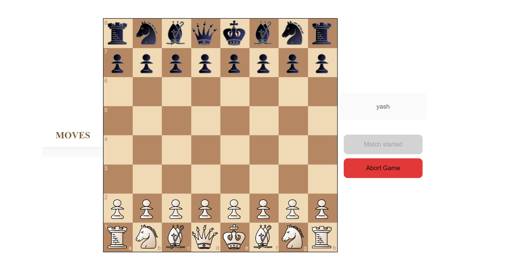
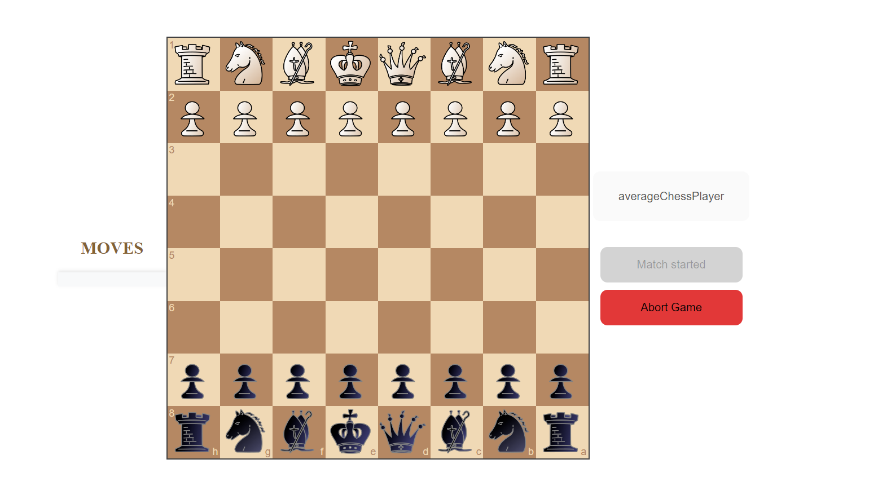

### Abort Game

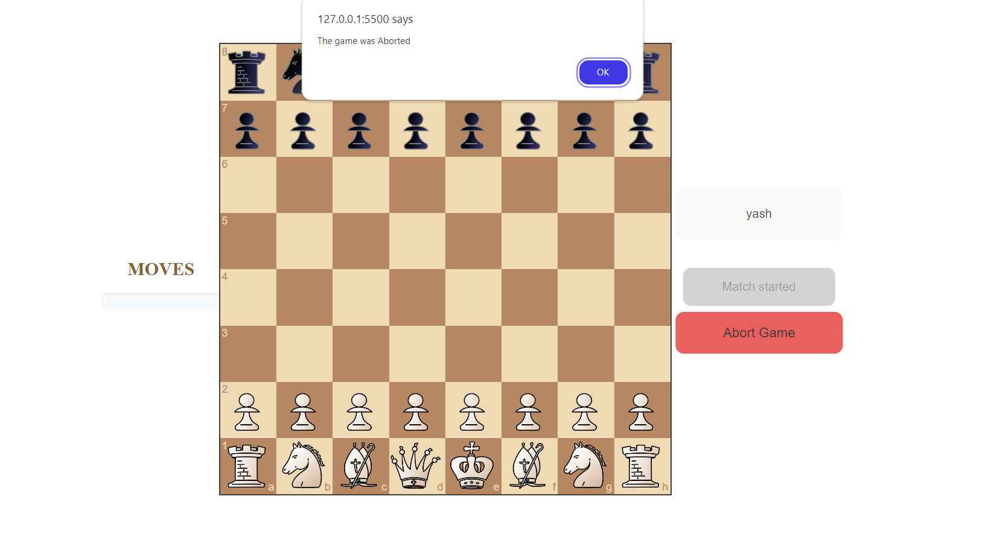
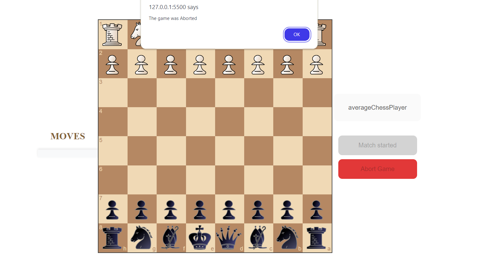

### Resign Game

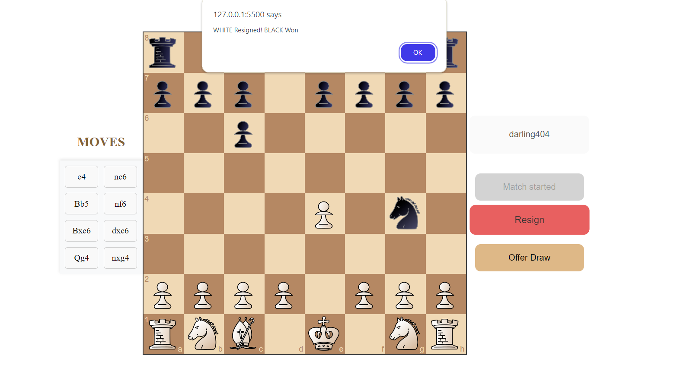
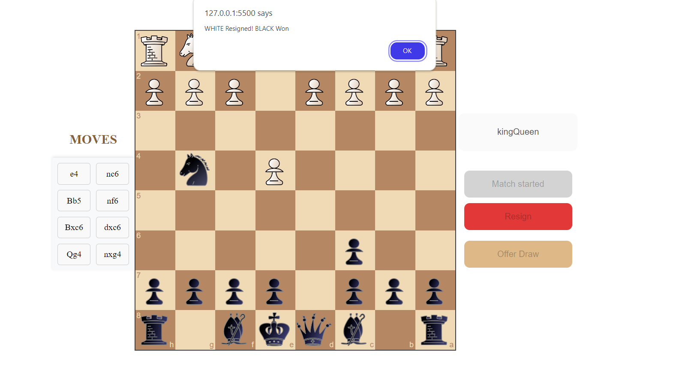

### Offer Draw

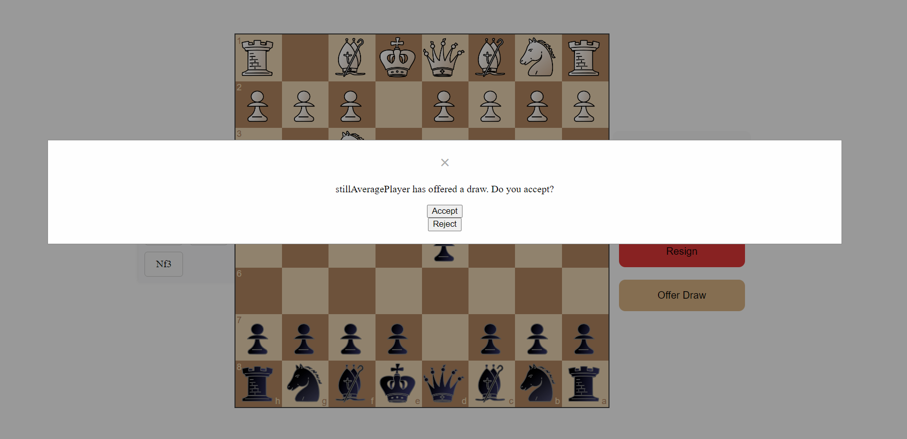
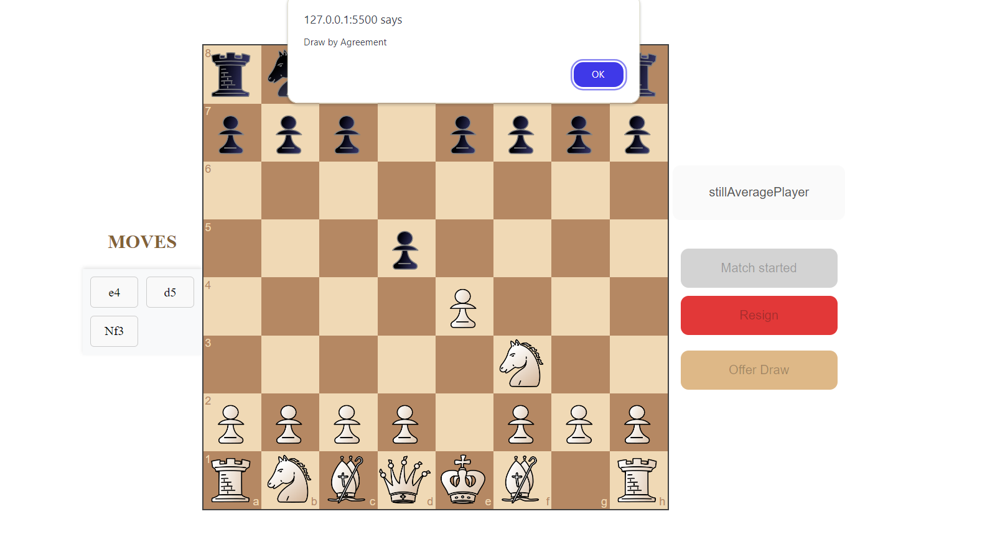

### Checkmate

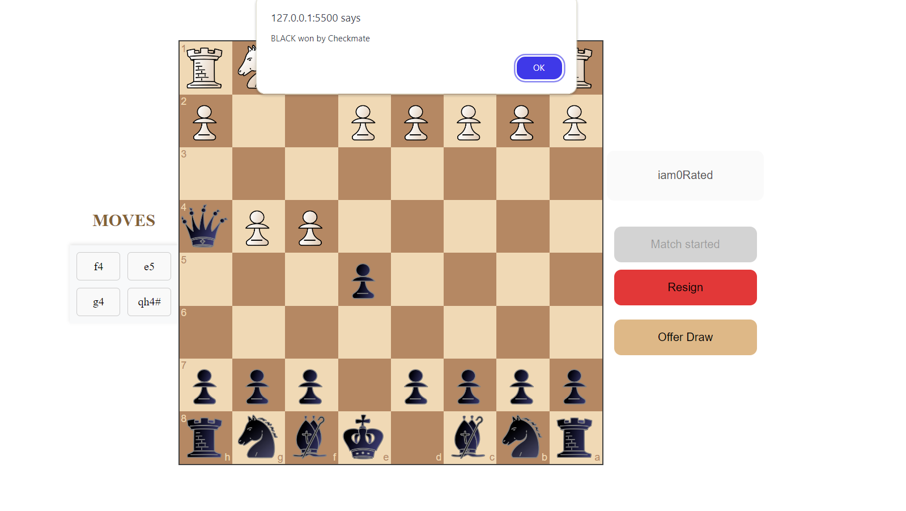
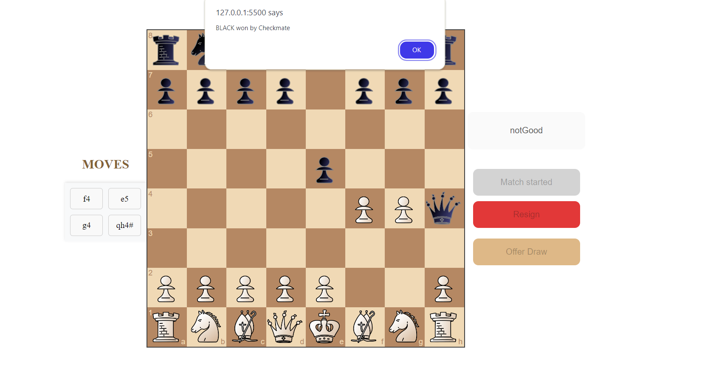


